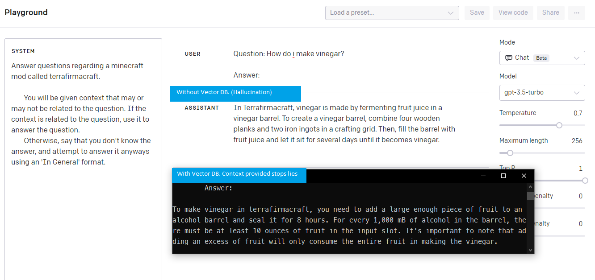

# TerrafirmaGPT (Retreival Augmented Generation)

TerrafirmaGPT is an AI-powered chatbot that utilizes Python, [OpenAI embeddings](https://platform.openai.com/docs/guides/embeddings), and [Pinecone.io](https://www.pinecone.io/) to provide users with modpack information and answer queries based on wiki pages.

The majority of the files in this repository are dedicated to preparing the data for Pinecone DB, handling ETL processes, and upserting the embeddings. Once these tasks are complete, you can use the `queryDB` file to interact with the chatbot through a command-line interface.

## Why

A GPT model will tend to hallucinate confidently to answer your question. We can see an example of how the correct context provided with a good prompt eliminates this problem.

## Notes:

Keep in mind that if you plan on implementing a similar system in a production environment, the data produced by the ETL process in this repository may not be as clean as required for production use. This project was developed quickly, and you should ensure that your data is clean and well-tested.

We used an arbitrary chunk size of 200 characters without much research. To determine the optimal chunk size for your project, you can test it by selecting a few documents you are familiar with, embedding questions about those documents, and then checking whether the generated chunks provide enough information to answer the questions.

If the chunks do not provide sufficient information, you can either increase the chunk size or return more documents for each query. In this repository, we have hardcoded the chatbot to return five documents per query.

To improve the chatbot's performance and adapt it to your specific needs, make sure to thoroughly test and optimize the data processing and chunk size parameters.
